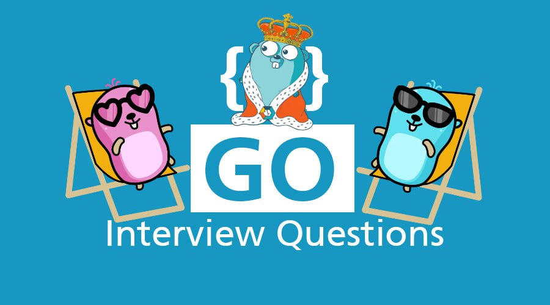

# Golang Interview Questions and Answers

### 🚀 Golang Interview Questions and Answers
- persian
  - [Data Type](interview/persian/data_type.md)
  - [Concurrency](interview/persian/concurrency.md)
  - [Concurrency Patterns](interview/persian/concurrency_patterns.md)

### 🚀 Golang Best Practice
- persian
  - [Golang](best-practice/persian/golang.md)

### 🚀 Golang Roadmap
- persian
  - [Golang](roadmap/persian/golang.md)